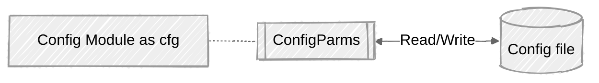
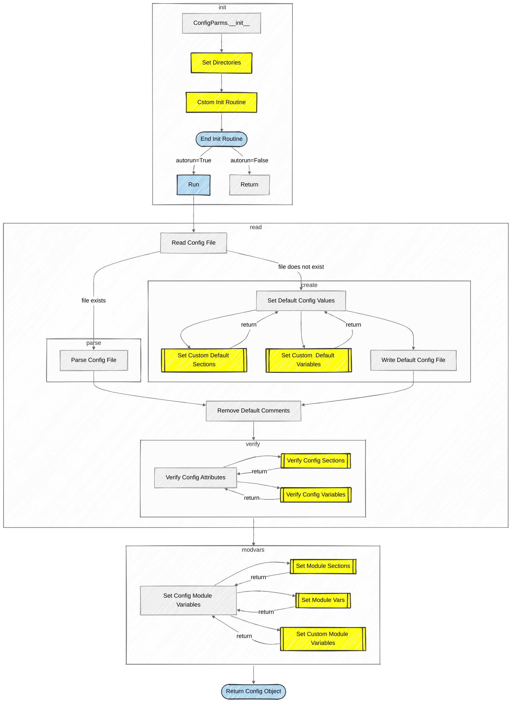

# Customizing the config file values

Customization falls into several categories: 
  - modifying the default paths to locate the config file and source library
  - modifying variables retrieved from the config file 
  - specifying custom variables (not in the config file)

While the app_config module handles Integer, Floats, Boolean, Strings and Lists, there are times when special handling of a section or individual variable is desired, ie creating Dictionaries.

A module *`configparms_ext.py`* is provided which subclasses the `configparms` class and provides a framework for overriding the standard behavior.

## Table of Contents
- [Overview](#customizing-the-config-file-values)
- [System Flow](#flow-diagram-for-app_config)
- [Hook Documentation](#documention-for-override-points)
- [Process Flow Chart](#configparms-flow-chart)
- [Coding Examples](#coding-examples)

## Flow diagram for app_config

This module is has several functions:
* Allow values to be passed into the system from a configuration file at run-time.
* Create a module consisting of the configuration file variables that can be used to pass paramters to other modules.
* Hooks are provided to allow specific formatting of sections and variables accepted from the configuation file. 
* Custom variables, which are not maintained in the configuration file can be inserted in the cfg module through the custom variable hook. 
* Manage the config file, reading parameters into the application, creating the initial file with defaults, updating existing config file if parameters are added or names change.


The general overview of the package is diagramed below.  The config.py module is imported as cfg and it will import configparms module.  Configparms reads the config file and loads the values into cfg.



## Documention for Customization Hooks

Customization of the configparms module is accomplished by subclassing.  This approach was taken due to its simplicity and flexiblity.

A module `configparm_ext.py` is copied into your src folder during the app_config-init step.  This module can be modified to override the default behavior of this package.  This module can be deleted and rerunning `app_config-init` will recreate it.

Refer to the comments in the configparms_ext.py module to customize the loading of data to the cfg module.

The following hooks are provided:

### Notes:

*cfg module* refers to the **import config as cfg** and consists of variables

*config object* refers to the configparser object that reads/writes the config file 

The *`Default Config Values`* and the *`Config Modules Variables`* are critical to format how sections and variables are stored in the config object and how they are stored in the cfg module.  The config object only deals with strings and so the get methods set the value in the cfg module.  When they are not the same, then the hooks alows for formatting them correctly. 

### Hooks


| Hook         | Description                               |
|--------------|------------------------------------------|
|**Init Routine** | There are 2 hooks in the class init routine|
|set_directories| Override the default paths to the data directory and other directories. This is used when the project structure is different than the strucure defined earlier.|
|custom_init_routine| Run any custom process need during init of the class.  Rarely used.|
| | |
|**Default Config Values Routine**| This routine sets the default values in the config object before writing the config file when no  config file is found.  The defaults are taken from the cfg module and added to the config object|
|set_custom_default_sects| Process any section that needs special handling, such as a dictionary that is converted into variables within a section in the config file.|
|set_custom_default_vars| Process any variable that needs special handling|
| | | 
|**Verify Config Attributes**| This routine verifies that the attributes defined in the cfg module list are set in the config object.  It also accepts any values passed from the config file which are to be set in the cfg module. This routine is processed after a read if the system version number is different and before the write (create) of the config file.|
|verify_config_sects| Process any section that needs special handling|
|verify_config_vars| Process any variable that needs special handling|
| | | 
|**Config Module Variables Routine**| This routine sets the cfg module variable from the config object.|
|set_module_sects| Process any section that needs special handling, such as a section whose variables are dictionary items.|
|set_module_vars| Process any variable that needs special handling, such as values that must be in a certain range|
|set_custom_module_vars| This hook allows for the seting of custom variables that are not needed in the config file or variables that are generated by values pased from the config file; such as a list or dictionary based on a count in the config file.|

## Configparms Flow Chart

In the diagram below, the blocks in yellow identify hooks that can be overridden.




## Coding Examples

The following coding examples are based on the following assumptions:

 - An application needs to sort things by bins and the bin numbers vary with each run.
 - A bin dict in the cfg module is built with the bin number as the key.
 - A random seed is either an integer or None

 In the cfg module, define the fields and add the number of bins to the var_list:
  ```python

# variables
num_bins = 4
sort_alpha = True
labels = ['label1', 'label2', 'label3', 'label4']
seed =
...
# define the vars in the config file 
cfg_values = {'MAIN': [('sort_alpha', 'b'), ('num_bins', 'i'), ('labels', 'l'), ('seed', 'i')]
...
# variables passed to all modules
bin_dict = {}

```

The config file looks like: 

```
[MAIN]
# this is a comment for var1
var1 = True
num_bins = 6
labels = red, green, blue, yellow, black, brown
seed = 3.14

[SYSTEM]
# changing the version number will cause file to be rewritten
sys_cfg_version = 0.1
```
The num_bins, var1 and labels are handled by the module.  However the seed and creation of the bin_dict need special processing.

Special processing can be done by using the configparms_ext module.  By changing the methods as outlined below, the variables can be processed.

```python

def set_module_vars(self) -> bool:
    """ special processing for module variables """
    #  set to True to skip the rest of the loop
    next_iter = False

    # random_seed must be int or it is changed to None
    if var_name == 'random_seed':
        seed = config.get(sec, var_name, fallback=cfg.getattr(var_name)
        try:
            cfg.getattr(var_name) = int(seed)
        except Exception as e:
            cfg.getattr(var_name) = None
        next_iter = True
    return next_iter

def set_custom_module_vars(self) -> None:
    """ set any custiom vars that are not being defined in the config.py module
        These generally are values that are derived from values received from the config file

        For example: build a list based on the number of items, as set in a config file varible
    """
    # build dict for num_bins
    cfg.bin_dict = {b: [] for b in range(cfg.num_bins)}
   
```
### For a more complex example:

In the config file, there is a section 'GROUP_LABELS' and all the variables in that section are lists of labels.  The variable in the cfg module is a list of lists.

```python

group_labels = [
  ['red','white','blue',],
  ['car','truck','suv',]
]

# in cfg_values define a custom section to be stored in the config file
cfg_values = {
          ...
          'GROUP_LABELS': [],
          ...
} 

# in the set_custom_default_sect, build the default config 
# file from the initial values of cfg.group_labels

def set_custom_default_sects(self,) -> bool:
        """ Process any section that needs special handling, 
        such as a dictionary that is converted into variables 
        within a section in the config file
        """
        #  set to True to skip the rest of the loop
        next_iter = False
        if sec == 'GROUP_LABELS':
            for i, g in enumerate(cfg.group_labels):
                config.set('GROUP_LABELS', f'sess{i}', ','.join(x for x in g))
            next_iter = True
        return next_iter

# the default config file will look like this
[GROUP_LABELS]
sess0 = red,white,blue
sess1 = car,truck,suv

# changing the config file to look like
[GROUP_LABELS]
sess0 = group1,group2,group3,group4,group5
sess1 = blue,red,green,yellow,pink
sess2 = Portales,Santa Fe,Taos,Chama,Cuba
sess3 = Elbert,Massive,Harvard,Blanca,La Plata

# skip the group_labels in the verification step
def verify_config_sects(self, config, sec, vars) -> bool:
        """ special processing for module groups """
        #  set to True to skip the rest of the loop
        next_iter = False
        # bypass verification
        if sec = 'GROUP_LABELS':
          next_iter = True
        return next_iter

# then in the set_module_sects_
 def set_module_sects(self, config) -> bool:
        """ set any custiom vars that are not being defined in the config.py module
            These generally are values that are derived from values 
            received from the config file

            For example: build a list based on the number of items, 
            as set in a config file varible
        """
        """ read group label dict and build a list of lists of the labels
            for each group in a session this removes the key from the
            dict and does not force a naming convention in the cfg file
        """
        group_labels = []
        for k, v in config['GROUP_LABELS'].items():
            group_labels.append(v.split(','))

        # group_labels is a list of list, check for '' and remove
        ngl = []
        for s in group_labels:
            new_s = [gl for gl in s if gl != '']
            ngl.append(new_s)

        cfg.group_labels = ngl

        pass

# output in the cfg module
group_labels = [['group1,group2,group3,group4,group5'],
                ['blue,red,green,yellow,pink'],
                ['Portales,Santa Fe,Taos,Chama,Cuba'],
                ['Elbert,Massive,Harvard,Blanca,La Plata'],
               ]
```
